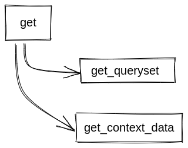
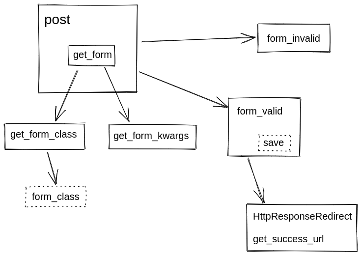

```bash
git clone https://github.com/rg3915/django-cbv-tutorial.git
cd django-cbv-tutorial
git branch base origin/base
git checkout base

python -m venv .venv
source .venv/bin/activate

pip install -U pip
pip install -r requirements.txt
pip install ipdb

python contrib/env_gen.py

python manage.py migrate
python manage.py createsuperuser --username="admin" --email="admin@email.com"
```

```python
python manage.py shell_plus

persons = ['Huguinho', 'Zezinho', 'Luizinho']

for person in persons:
    Person.objects.create(first_name=person)
```

Editar `core/views.py`

View

```python
# core/views.py
from django.shortcuts import render
from django.views.generic import ListView, TemplateView, View

from pocket.financial.models import Expense

class IndexView(View):

    def get(self, request):
        template_name = 'index.html'
        expense_list = Expense.objects.all()
        context = {'expense_list': expense_list}
        return render(request, template_name, context)
```



TemplateView

```python
# core/views.py
class IndexView(TemplateView):
    model = Expense
    template_name = 'index.html'

    def get_context_data(self, **kwargs):
        expense_list = Expense.objects.all()
        context = {'expense_list': expense_list}
        return context
```

ListView

```python
# core/views.py
class IndexView(ListView):
    model = Expense
    template_name = 'index.html'
    context_object_name = 'expense_list'
```

Criar em `financial/views.py`

```python
# financial/views.py
class ExpenseListView(ListView):
    model = Expense
    # context_object_name = 'expense_list'
    # paginate_by = 10
    # template_name = 'expense_list.html'


class ExpenseNotPaidListView(ListView):
    model = Expense

    def get_queryset(self):
        return Expense.objects.filter(paid=False)


class ExpenseDetailView(DetailView):
    model = Expense


class ExpenseCreateView(CreateView):
    model = Expense
    form_class = ExpenseForm


class ExpenseUpdateView(UpdateView):
    model = Expense
    form_class = ExpenseEditForm


class ExpenseDeleteView(DeleteView):
    model = Expense
    success_url = reverse_lazy('financial:expense_list')
```

ExpenseListView

dispatch

LoginRequiredMixin

```python
# financial/views.py
class ExpenseListView(LRM, ExpenseContextDataMixin, SearchMixin, ListView):
    model = Expense
    # context_object_name = 'expense_list'
    # paginate_by = 10
    # template_name = 'expense_list.html'

    @method_decorator(login_required)
    def dispatch(self, request, *args, **kwargs):
        if not request.user.is_authenticated:
            message = 'Você não tem permissão para acessar essa página.'
            messages.error(request, message)
            return redirect('core:index')
        return super(ExpenseListView, self).dispatch(request, *args, **kwargs)
```

get_context_data

```python
# financial/mixins.py
class ExpenseContextDataMixin:

    def get_context_data(self, **kwargs):
        context = super().get_context_data(**kwargs)
        context['verbose_name'] = self.model._meta.verbose_name.title()
        context['verbose_name_plural'] = self.model._meta.verbose_name_plural.title()  # noqa E501
        context['total'] = sum(self.object_list.values_list('value', flat=True))  # noqa E501
        return context
```

get_queryset

```python
# financial/mixins.py
class SearchMixin:

    def get_queryset(self):
        queryset = super(SearchMixin, self).get_queryset()
        search = self.request.GET.get('search')
        if search:
            return queryset.filter(
                Q(person__first_name__icontains=search) |
                Q(person__last_name__icontains=search) |
                Q(person__email__icontains=search)
            )
        return queryset
```


ExpenseCreateView




get_form_kwargs

```python
# financial/mixins.py
class ExpenseFormKwargsMixin:

    def get_form_kwargs(self):
        kwargs = super().get_form_kwargs()
        kwargs['request'] = self.request
        print(kwargs)
        return kwargs
```

get_context_data

post

form_valid

get_success_url

get_form_class

get_form_kwargs

```python
# financial/views.py
class ExpenseCreateView(ExpenseFormKwargsMixin, CreateView):
    model = Expense
    form_class = ExpenseForm

    def get_context_data(self, **kwargs):
        context = super().get_context_data(**kwargs)
        # user = self.request.user
        person = Person.objects.get(first_name='Huguinho')
        context['huguinho_expenses'] = Expense.objects.filter(person=person)
        return context

    def post(self, request, *args, **kwargs):
        print('>>> POST')
        # Serve pra debugar o código e pegar os valores do formulário.
        # request.POST
        # request.FILES
        # form = self.get_form()
        # form.is_valid()
        # form.errors
        # Exemplificar isso aqui.
        form = super().post(request, *args, **kwargs)
        return form

    def form_valid(self, form):
        # form.send_email()
        print('Enviar email')
        return super(ExpenseCreateView, self).form_valid(form)

    def get_success_url(self):
        return reverse_lazy('financial:expense_list')

    def get_form_class(self):
        if self.request.user.is_authenticated:
            return ExpenseEditForm
        return ExpenseForm

    def get_form_kwargs(self):
        kwargs = super().get_form_kwargs()
        print('>>>', kwargs)
        print()
        print('data:', kwargs.get('data'))
        print()
        print('files:', kwargs.get('files'))
        return kwargs
```
